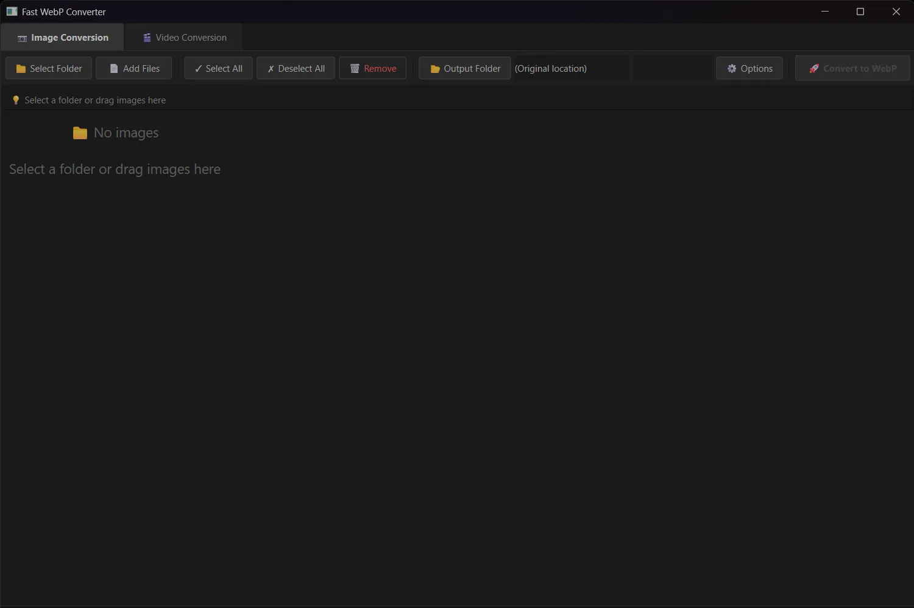
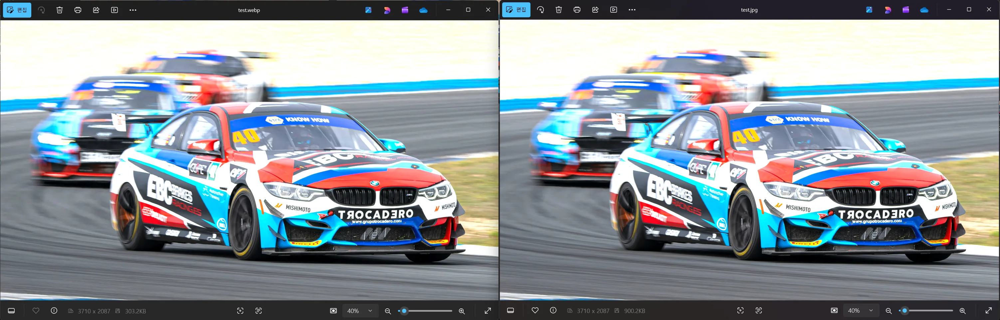
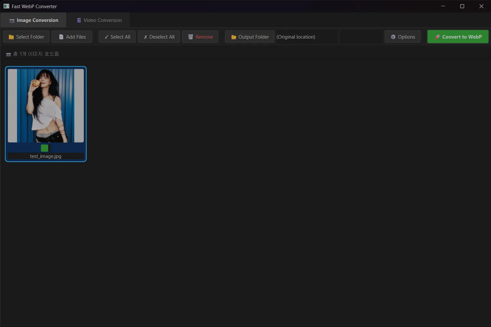
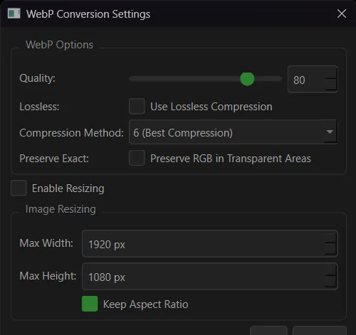
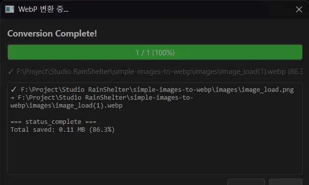

# Fast WebP Converter



이미지와 동영상 파일을 WebP 포맷으로 변환하는 윈도우 데스크톱 애플리케이션입니다.

---

## 개요

**Fast WebP Converter**는 여러 장의 이미지와 동영상 파일을 **WebP** 포맷으로 변환하는 도구입니다. UI 프리징 없는 비동기 처리와 멀티프로세싱을 지원하여 변환 속도를 최적화했습니다.



### 주요 특징

*   **성능**: `Multiprocessing`을 사용하여 CPU 코어를 활용해 병렬 변환 처리를 수행합니다.
*   **사용 편의성**: 드래그 앤 드롭으로 파일을 추가할 수 있습니다.
*   **동영상 지원**: 동영상 파일을 Animated WebP로 변환할 수 있습니다.
*   **옵션 제어**: 화질, 압축률, 크기 리사이징 등의 변환 옵션을 상세하게 설정할 수 있습니다.
*   **미리보기**: 변환 전 파일 목록을 썸네일 그리드 형태로 확인할 수 있습니다.

---

## 설치 방법

### 1. Windows 실행 파일
배포된 실행 파일을 다운로드하여 설치 없이 바로 실행할 수 있습니다.
[[릴리즈 페이지](https://github.com/studio-rainshelter/simple-images-to-webp/releases)]

### 2. 소스 코드 실행
Python 환경에서 직접 실행할 수 있습니다.

```bash
# 1. 저장소 복제
git clone https://github.com/studio-rainshelter/simple-images-to-webp.git

# 2. 필수 라이브러리 설치
pip install -r requirements.txt

# 3. 실행
python main.py
```

---

## 상세 사용 가이드

### 1️⃣ 이미지 변환 (Image Converter)

1.  **파일 불러오기**:
    *   상단 탭에서 **[📷 이미지 변환]**을 선택합니다.
    *   변환할 이미지들을 프로그램 창으로 **드래그 앤 드롭**하거나, `📁 폴더 선택` 버튼을 누릅니다.
    *   
2.  **변환 대상 선택**:
    *   썸네일 목록에서 이미지를 선택합니다. (Ctrl+클릭으로 다중 선택)
    *   `✓ 전체 선택` 버튼으로 전체 파일을 선택할 수 있습니다.
3.  **옵션 설정**: `⚙️ 옵션` 버튼을 눌러 변환 설정을 변경합니다.
    *   **품질 (Quality)**: `0~100` 사이 값 설정. (기본값: 80)
    *   **무손실 (Lossless)**: 화질 손실 없이 압축하는 모드입니다.
    *   **압축 효율 (Method)**: `0(빠름)` ~ `6(최대 압축)` 중 선택. (기본값: 4)
    *   **크기 조절 (Resize)**: 지정된 너비/높이로 리사이징합니다. (`비율 유지` 옵션 포함)
    *   
4.  **변환 시작**:
    *   `📂 출력 폴더`를 확인하고 `🚀 WebP 변환` 버튼을 클릭합니다.
    *   

### 2️⃣ 동영상 변환 (Video Converter)

동영상 파일을 Animated WebP로 변환합니다.

1.  **파일 불러오기**:
    *   상단 탭에서 **[🎬 동영상 변환]**을 선택합니다.
    *   동영상 파일을 드래그 앤 드롭합니다.
2.  **옵션 설정**:
    *   **프리셋 (Preset)**: `균형`, `고품질`, `최소 용량` 프리셋을 선택할 수 있습니다.
    *   **FPS (초당 프레임)**: 프레임 수를 설정합니다. (기본값: 15)
    *   **루프 (Loop)**: 반복 횟수를 지정합니다. (`0`: 무한 반복)
    *   **크기 제한**: 최대 해상도를 제한할 수 있습니다.
    *   **길이 제한**: 변환할 영상의 최대 길이를 제한할 수 있습니다.
    *   [이미지 추가 필요 : 동영상 변환 설정 다이얼로그 화면]
3.  **변환 시작**:
    *   `🚀 WebP 변환` 버튼을 클릭하여 변환을 시작합니다.

---

## 기술 스택

*   **Core**: Python 3.10+, PyQt6
*   **Image Processing**: Pillow (PIL)
*   **Video Processing**: FFmpeg (imageio-ffmpeg)
*   **Concurrency**: Python Multiprocessing & QThread
*   **Packaging**: PyInstaller

---

## 라이선스

Copyright © 2025 Studio RainShelter. All Rights Reserved.
